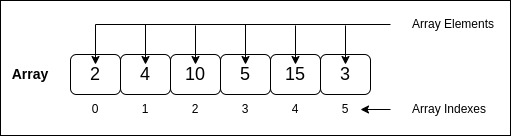

# 3.1 Arrays

## What is an Array?

An **array** is a collection of elements, typically of the same data type, arranged in a contiguous block of memory. Each element in an array is accessed using its index, making arrays efficient for random access.

<p align="center">
  
</p>

### Characteristics of Arrays

- **Fixed Size**: The size of an array is defined at the time of its creation and cannot be changed.
- **Efficient Access**: Accessing an element by index is fast (O(1) time complexity).

### Basic Operations and Complexity

| Operation   | Description                                  | Time Complexity | Space Complexity |
|-------------|----------------------------------------------|-----------------|------------------|
| Access      | Retrieve an element by its index            | O(1)            | O(1)             |
| Update      | Modify an element at a specific index       | O(1)            | O(1)             |
| Traversal   | Visit each element in the array             | O(n)            | O(1)             |
| Insertion   | Add an element (if resizing is needed)      | O(n)            | O(n)             |
| Deletion    | Remove an element (requires shifting)       | O(n)            | O(n)             |

### Example in Go: Basic Array Operations

```go
package main

import "fmt"

func main() {
    // Declaring and initializing an array
    numbers := [5]int{10, 20, 30, 40, 50}
    fmt.Println("Array:", numbers)

    // Accessing elements by index (O(1) time complexity)
    fmt.Println("Element at index 2:", numbers[2])

    // Updating an element (O(1) time complexity)
    numbers[3] = 100
    fmt.Println("Updated Array:", numbers)

    // Traversing the array (O(n) time complexity)
    fmt.Println("Array elements:")
    for i := 0; i < len(numbers); i++ {
        fmt.Printf("Index %d: %d
", i, numbers[i])
    }
}
```

### Advantages of Arrays

- **Fast Access**: Elements can be accessed in constant time using their index.
- **Simple Structure**: Arrays are straightforward to use for storing a fixed set of elements.

### Limitations of Arrays

- **Fixed Size**: Once an array is created, its size cannot be changed.
- **Memory Waste**: Allocating an array that is too large wastes memory, while one too small limits capacity.

---

[Continue to 3.2 Linked Lists](./Section_3_2_Linked_Lists.md)
