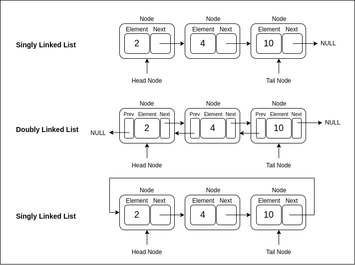

# 3.2 Linked Lists

## What is a Linked List?

A **linked list** is a linear data structure in which each element is a separate object called a node. Each node contains data and a reference (or link) to the next node in the sequence. Linked lists are dynamic, allowing efficient insertion and deletion operations.

### Types of Linked Lists

1. **Singly Linked List**: Each node has a single link to the next node.
2. **Doubly Linked List**: Each node has links to both the next and previous nodes.
3. **Circular Linked List**: The last node links back to the first node, creating a circular chain.

<p align="center">
  
</p>

### Tail Pointer Optimization

In a linked list with a **tail pointer** (a pointer to the last node), certain operations, such as insertion at the end, can be optimized to run in constant time **O(1)**, rather than requiring traversal through the entire list.

### Basic Operations and Complexity

| Operation   | Description                                        | Time Complexity | Space Complexity |
|-------------|----------------------------------------------------|-----------------|------------------|
| Access      | Retrieve an element by its position (index)       | O(n)            | O(1)             |
| Insertion   | Add a new node at the beginning                   | O(1)            | O(1)             |
| Insertion   | Add a new node at the end (with tail pointer)     | O(1)            | O(1)             |
| Deletion    | Remove a node from the beginning                  | O(1)            | O(1)             |
| Deletion    | Remove a node from the end (with tail pointer)    | O(n) or O(1)*   | O(1)             |
| Traversal   | Visit each element in the list                    | O(n)            | O(1)             |

*Note: Deletion at the end is O(1) only if a doubly linked list is used with a tail pointer.

### Example in Go: Singly Linked List with Tail Pointer

```go
package main

import "fmt"

type Node struct {
    data int
    next *Node
}

type LinkedList struct {
    head *Node
    tail *Node // Tail pointer to enable O(1) insertion at the end
}

// InsertAtBeginning adds a new node to the beginning of the list (O(1) time complexity)
func (list *LinkedList) InsertAtBeginning(data int) {
    newNode := &Node{data: data}
    newNode.next = list.head
    list.head = newNode
    if list.tail == nil { // If list was empty, set tail to the new node
        list.tail = newNode
    }
}

// InsertAtEnd adds a new node to the end of the list (O(1) with tail pointer)
func (list *LinkedList) InsertAtEnd(data int) {
    newNode := &Node{data: data}
    if list.tail != nil {
        list.tail.next = newNode
    } else {
        list.head = newNode
    }
    list.tail = newNode
}

// Display prints all nodes in the list (O(n) time complexity)
func (list *LinkedList) Display() {
    current := list.head
    for current != nil {
        fmt.Printf("%d -> ", current.data)
        current = current.next
    }
    fmt.Println("nil")
}

func main() {
    list := LinkedList{}
    list.InsertAtBeginning(10)
    list.InsertAtBeginning(20)
    list.InsertAtEnd(30)
    list.Display()
}
```

### Advantages of Linked Lists

- **Dynamic Size**: Unlike arrays, linked lists can grow or shrink in size dynamically.
- **Efficient Insertions/Deletions**: Insertions and deletions are faster, especially at the beginning of the list.

### Limitations of Linked Lists

- **No Random Access**: Elements must be accessed sequentially, which can be slower than arrays for certain operations.
- **Memory Overhead**: Each node requires extra memory for the link.

---

[Continue to 3.3 Stacks](./Section_3_3_Stacks.md)
