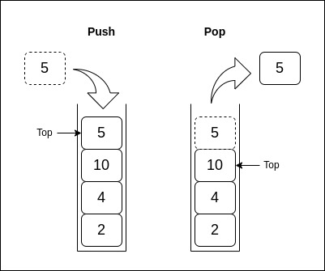

# 3.3 Stacks

## What is a Stack?

A **stack** is a linear data structure that follows the Last-In, First-Out (LIFO) principle, meaning that the last element added is the first one removed. Stacks are used in applications like function call management, undo mechanisms, and parsing expressions.

<p align="center">
  
</p>

### Basic Operations and Complexity

| Operation   | Description                                  | Time Complexity | Space Complexity |
|-------------|----------------------------------------------|-----------------|------------------|
| Push        | Add an element to the top of the stack       | O(1)            | O(1)             |
| Pop         | Remove the element from the top of the stack | O(1)            | O(1)             |
| Peek        | Retrieve the top element without removing it | O(1)            | O(1)             |
| IsEmpty     | Check if the stack is empty                  | O(1)            | O(1)             |

### Example in Go: Stack Implementation

```go
package main

import "fmt"

// Stack structure with a slice
type Stack struct {
    items []int
}

// Push adds an item to the stack (O(1) time complexity)
func (s *Stack) Push(item int) {
    s.items = append(s.items, item)
}

// Pop removes an item from the stack (O(1) time complexity)
func (s *Stack) Pop() int {
    if len(s.items) == 0 {
        fmt.Println("Stack is empty")
        return -1
    }
    item := s.items[len(s.items)-1]
    s.items = s.items[:len(s.items)-1]
    return item
}

// Peek returns the top item without removing it (O(1) time complexity)
func (s *Stack) Peek() int {
    if len(s.items) == 0 {
        fmt.Println("Stack is empty")
        return -1
    }
    return s.items[len(s.items)-1]
}

func main() {
    stack := Stack{}
    stack.Push(1)
    stack.Push(2)
    fmt.Println("Top item:", stack.Peek())
    fmt.Println("Popped item:", stack.Pop())
    fmt.Println("Stack after pop:", stack.items)
}
```

### Advantages of Stacks

- **Simple to Use**: The LIFO structure is intuitive for managing elements in certain order-dependent applications.
- **Supports Recursive Operations**: Used to manage function calls and recursive operations.

### Limitations of Stacks

- **Limited Access**: Only the top element is accessible directly.
- **Fixed Size (for Static Stacks)**: Dynamic stacks using slices can grow, but fixed stacks cannot exceed their initial size.

---

[Continue to 3.4 Queues](./Section_3_4_Queues.md)
