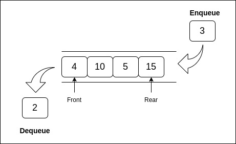

# 3.4 Queues

## What is a Queue?

A **queue** is a linear data structure that follows the First-In, First-Out (FIFO) principle, meaning that the first element added is the first one removed. Queues are commonly used in scheduling tasks, managing print jobs, and handling requests in web servers.

<p align="center">
  
</p>

### Basic Operations and Complexity

| Operation   | Description                                     | Time Complexity | Space Complexity |
|-------------|-------------------------------------------------|-----------------|------------------|
| Enqueue     | Add an element to the end of the queue          | O(1)            | O(1)             |
| Dequeue     | Remove an element from the front of the queue   | O(1)            | O(1)             |
| Peek        | Retrieve the front element without removing it  | O(1)            | O(1)             |
| Traversal   | Access each element in the queue                | O(n)            | O(1)             |

### Example in Go: Queue Implementation

```go
package main

import "fmt"

type Queue struct {
    items []int
}

// Enqueue adds an item to the end of the queue (O(1) time complexity)
func (q *Queue) Enqueue(item int) {
    q.items = append(q.items, item)
}

// Dequeue removes an item from the front of the queue (O(1) time complexity)
func (q *Queue) Dequeue() int {
    if len(q.items) == 0 {
        fmt.Println("Queue is empty")
        return -1
    }
    item := q.items[0]
    q.items = q.items[1:]
    return item
}

// Peek returns the front item without removing it (O(1) time complexity)
func (q *Queue) Peek() int {
    if len(q.items) == 0 {
        fmt.Println("Queue is empty")
        return -1
    }
    return q.items[0]
}

func main() {
    queue := Queue{}
    queue.Enqueue(1)
    queue.Enqueue(2)
    fmt.Println("Front item:", queue.Peek())
    fmt.Println("Dequeued item:", queue.Dequeue())
    fmt.Println("Queue after dequeue:", queue.items)
}
```

### Advantages of Queues

- **FIFO Order**: Ensures that the oldest element is processed first, ideal for scheduling and task management.
- **Efficient for Sequential Processing**: Useful in applications where data needs to be processed in the order it arrives.

### Limitations of Queues

- **Limited Access**: Only the front and back elements are accessible.
- **Memory Waste**: Static queues with fixed sizes can waste memory if not fully utilized.

---

[Continue to 4.1 Trees](./4_1_Trees.md)
