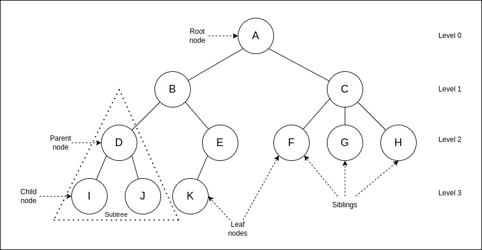

# 4.1 Trees

## What is a Tree?

A **tree** is a non-linear data structure that represents a hierarchy. Trees are composed of nodes, with each node containing data and a link to its child nodes. The topmost node is called the **root**, and nodes without children are called **leaf nodes**.

<p align="center">
  
</p>

### Types of Trees

Trees come in various types, each with specific characteristics and uses. Below is a breakdown of general trees, binary trees, and binary search trees, along with their unique properties.

#### General Trees

- **Structure**: In a general tree, each node can have any number of child nodes, allowing more flexible hierarchical representation.
- **Properties**:
  - Each node may have multiple children.
  - There are no constraints on child positioning or ordering.
- **Use Cases**:
  - Useful for structures without strict child constraints, like XML or HTML documents and file systems.

#### Binary Trees

1. **Binary Tree**: Each node has up to two children, commonly referred to as the left and right children.
   - **Full Binary Tree**: Every node has either 0 or 2 children.
   - **Complete Binary Tree**: All levels, except possibly the last, are fully filled, with nodes as left-aligned as possible.
   - **Perfect Binary Tree**: All levels are fully filled, and every internal node has exactly two children.
2. **Binary Search Tree (BST)**: A specialized binary tree where:
   - The left child is less than the parent, and the right child is greater.
   - This ordering enables efficient searching, insertion, and deletion operations.

### Basic Operations and Complexity

| Operation   | Description                                      | Time Complexity (BST) | Space Complexity |
|-------------|--------------------------------------------------|-----------------------|------------------|
| Search      | Find a node with a specific value                | O(log n) on average   | O(1)             |
| Insertion   | Add a new node                                   | O(log n) on average   | O(1)             |
| Deletion    | Remove a node                                    | O(log n) on average   | O(1)             |
| Traversal   | Visit each node (e.g., In-Order, Pre-Order)      | O(n)                  | O(1)             |

*Note: In the worst case (unbalanced tree), operations may degrade to O(n).

### Example in Go: Binary Search Tree

```go
package main

import "fmt"

type TreeNode struct {
    value int
    left  *TreeNode
    right *TreeNode
}

func (node *TreeNode) Insert(value int) {
    if value < node.value {
        if node.left == nil {
            node.left = &TreeNode{value: value}
        } else {
            node.left.Insert(value)
        }
    } else {
        if node.right == nil {
            node.right = &TreeNode{value: value}
        } else {
            node.right.Insert(value)
        }
    }
}

func (node *TreeNode) InOrder() {
    if node == nil {
        return
    }
    node.left.InOrder()
    fmt.Printf("%d ", node.value)
    node.right.InOrder()
}

func main() {
    root := &TreeNode{value: 10}
    root.Insert(5)
    root.Insert(15)
    root.Insert(8)
    fmt.Println("In-order traversal:")
    root.InOrder()
}
```

### Advantages of Trees

- **Hierarchical Structure**: Trees represent hierarchical data effectively, like folder structures.
- **Efficient Searching**: Binary search trees allow efficient searching and sorting.

### Limitations of Trees

- **Complexity**: Managing trees is more complex than linear data structures.
- **Memory Overhead**: Each node requires additional memory for pointers.

---

[Continue to 4.2 Graphs](./Section_4_2_Graphs.md)
